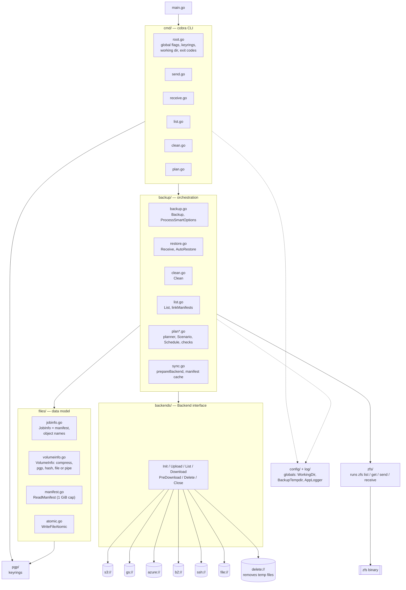
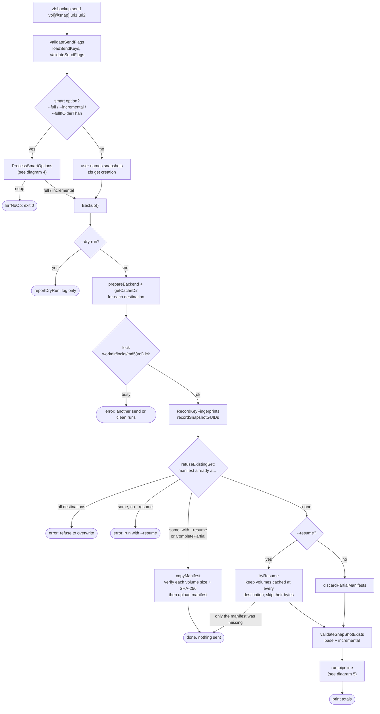
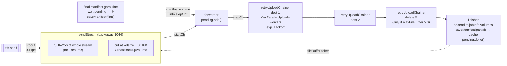
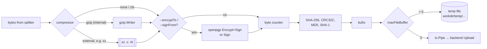
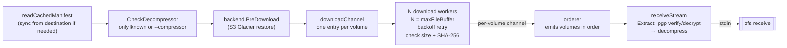
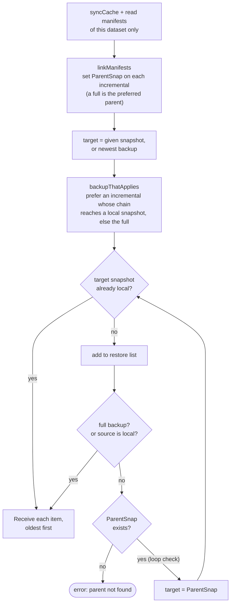
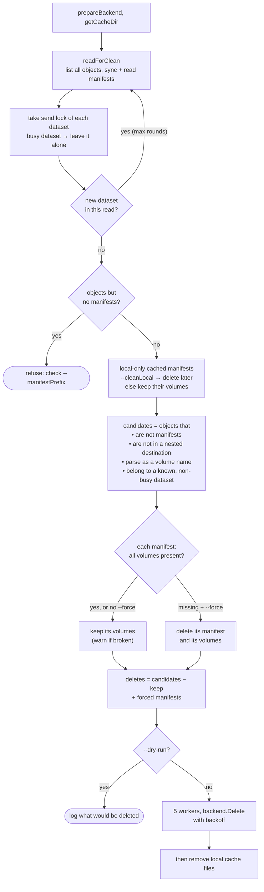
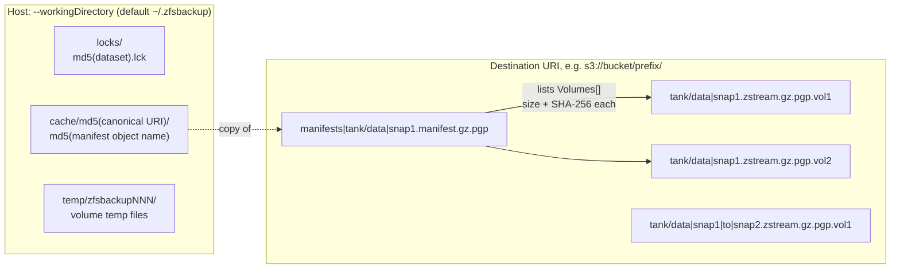
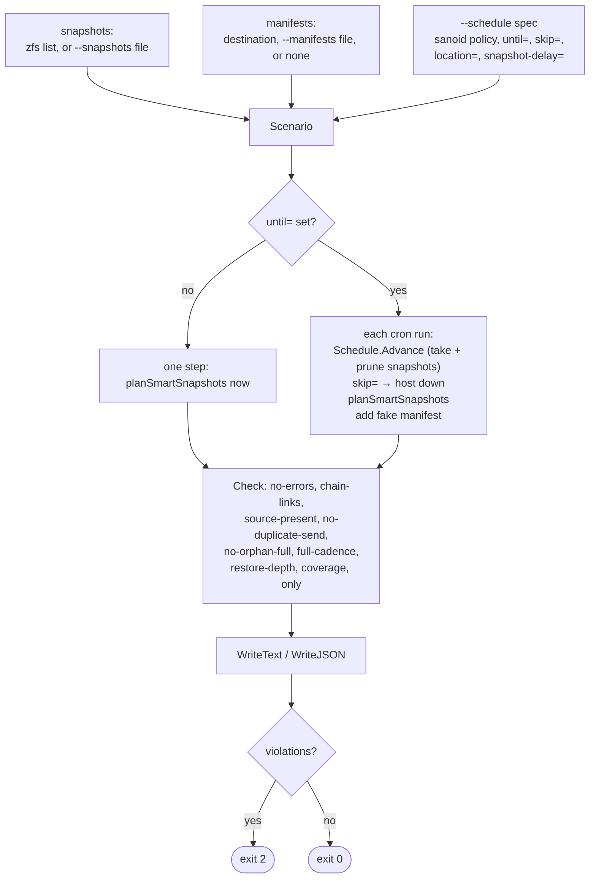

# zfsbackup-go architecture

Diagrams of the code on branch `clean-dry-run`. Each diagram names the function that does the work.

1. [Packages](#1-packages)
2. [Commands and entry points](#2-commands-and-entry-points)
3. [send: control flow](#3-send-control-flow)
4. [send: smart planning](#4-send-smart-planning)
5. [send: data pipeline](#5-send-data-pipeline)
6. [One volume: writer layers](#6-one-volume-writer-layers)
7. [receive: data pipeline](#7-receive-data-pipeline)
8. [receive --auto: chain walk](#8-receive---auto-chain-walk)
9. [clean](#9-clean)
10. [Storage layout](#10-storage-layout)
11. [plan: simulator](#11-plan-simulator)

## 1. Packages



`internal/fakezfs` is a fake `zfs` binary for the e2e tests. Production code does not use it.

## 2. Commands and entry points

| Command          | Entry point                                   | Reads                               | Writes                                               |
| ---------------- | --------------------------------------------- | ----------------------------------- | ---------------------------------------------------- |
| `send`           | `backup.Backup` (`backup/backup.go:401`)      | zfs, manifests at every destination | volumes + manifest at every destination, local cache |
| `receive`        | `backup.Receive` (`backup/restore.go:253`)    | one manifest, its volumes           | `zfs receive`                                        |
| `receive --auto` | `backup.AutoRestore` (`backup/restore.go:54`) | all manifests of the dataset        | many `Receive` calls                                 |
| `list`           | `backup.List` (`backup/list.go:44`)           | manifests at one destination        | stdout                                               |
| `clean`          | `backup.Clean` (`backup/clean.go:176`)        | all objects at one destination      | deletes objects, local cache files                   |
| `plan`           | `cmd.runPlan` (`cmd/plan.go:143`)             | zfs or files, manifests             | stdout only                                          |

Exit codes (`cmd/root.go:94`): `0` = success or nothing new; `2` = plan checks failed or last backup newer than pool; `1` = other plan error; `255` = any other error.

## 3. send: control flow



## 4. send: smart planning

`ProcessSmartOptions` (`backup/backup.go:72`) → `selectSmartSnapshots` → `planSmartSnapshots` (`backup/plan.go:94`). `plan` uses the same function, so `send` and `plan` choose the same action.

```mermaid
flowchart TD
    IN["zfs list snapshots +<br/>manifests at each destination<br/>(getBackupsForTarget)"] --> PC["PartialSetCompletable<br/>--resume, or the lagging destination<br/>has every volume of the set"]
    PC --> F{"--full?"}
    F -- yes --> FH{"full of newest *FullSuffix<br/>snapshot exists at…"}
    FH -- all --> NO1(["noop: already-backed-up"])
    FH -- "some, no --resume" --> ERR1(["error: destinations out of sync"])
    FH -- none / --resume --> FULL1(["full: explicit-full"])

    F -- no --> PS{"partial set at some<br/>destinations and completable?"}
    PS -- yes --> CP(["full or incremental:<br/>complete-partial<br/>Backup copies manifest only"])
    PS -- no --> LAST["newest backup per destination<br/>checkLastBackupsOnPool"]
    LAST -- "newer than pool" --> FUT(["ErrLastBackupInFuture: exit 2"])
    LAST --> R{"why?"}
    R -- "no full yet" --> FULL2(["full: no-previous-full"])
    R -- "last full older than<br/>--fullIfOlderThan" --> FULL3(["full: window-elapsed"])
    R -- "incremental source<br/>pruned from pool" --> FULL4(["full: source-pruned"])
    R -- "newer *IncrSuffix snapshot" --> INC(["incremental: newer-candidate"])
    R -- "nothing newer" --> NO2(["noop: nothing-newer"])
```

## 5. send: data pipeline

All stages run as goroutines in one `errgroup`. A failure in any stage cancels `ctx` and stops all stages. No final manifest is written after a failure.



Key points:

- Destinations form a **chain**, not a fan-out. Dest 2 gets a volume only after dest 1 uploads it.
- The `delete://` backend is the last link. It deletes the temp file after every real destination has the volume.
- `fileBuffer` tokens limit the number of temp files on disk (`--maxFileBuffer`).
- `--maxFileBuffer 0` uses pipes, not temp files. Then only one destination is allowed and a failed upload cannot retry.
- The manifest goes through the same chain last. A set is complete only when its manifest is at the destination.

## 6. One volume: writer layers

`files.prepareVolume` (`files/volumeinfo.go:607`) and `CreateSimpleVolume`. Read is the reverse in `VolumeInfo.Extract`.



The manifest always uses internal gzip. Its hashes are of the **stored** bytes (after compress and pgp). `receive` checks size + SHA-256 of each download against the manifest.

## 7. receive: data pipeline

`backup.Receive` (`backup/restore.go:253`).



A size or SHA-256 mismatch is a permanent error. The retry loop does not try again.

## 8. receive --auto: chain walk

`backup.AutoRestore` (`backup/restore.go:54`).



## 9. clean

`backup.Clean` (`backup/clean.go:176`). It deletes only objects it can name as a backup volume of a dataset that a manifest at this destination names.



## 10. Storage layout



- Separator default is `|` (`--separator`). Incremental names are `<vol>|<from>|to|<to>`.
- `.gz` is the compressor; `.pgp` appears when you encrypt or sign.
- The cache key is the **canonical** URI. `getCacheDir` moves an old cache dir (keyed by the typed URI) into it.
- The lock lives in the working directory. `send` and `clean` see each other only on the same host with the same `--workingDirectory`.

## 11. plan: simulator

`cmd.runPlan` (`cmd/plan.go:143`), `Scenario.Run` (`backup/plan.go:340`), `Simulation.Check` (`backup/plan_checks.go:77`). `plan` never writes to a destination.


